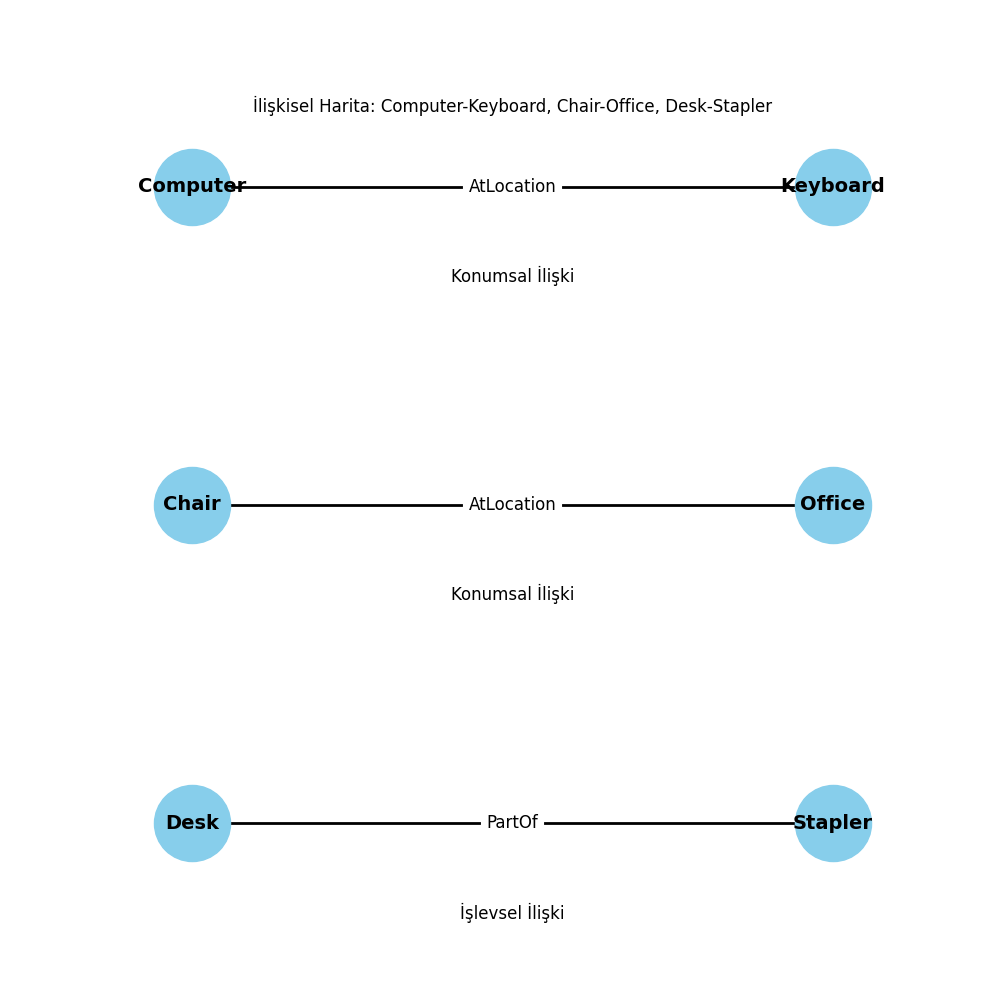

# 🔍 Exploring Object Relationships with ConceptNet API and Visualization in Python

## 📋 Project Overview

This project explores the relationships between objects using the **ConceptNet API** and visualizes these relationships using **NetworkX** and **Matplotlib**. We classify relationships into **spatial** and **functional** categories, and present them in an interactive graphical interface using **Tkinter**.

## 🌟 Sample Output



## 🛠️ Technical Requirements

To run the project, the following tools and libraries are required:

- Python 3.x
- **ConceptNet API** for fetching object relationships
- **NetworkX** and **Matplotlib** for graph-based visualizations
- **Tkinter** for GUI-based interaction
- **JSON** for data handling and saving results in files

## 📦 Project Setup

1. **Clone the Repository**:
    ```bash
    git clone https://github.com/your-repo/conceptnet-object-relationship.git
    cd conceptnet-object-relationship
    ```

2. **Install Dependencies**:
    Install the required libraries using the `requirements.txt` file:
    ```bash
    pip install -r requirements.txt
    ```

## 🔄 Usage

1. **Run the Main Script**:
    To query relationships, classify them, and visualize the output, run:
    ```bash
    python main.py
    ```

2. **Generated JSON Files**:
    After running the script, JSON files with the object relationships will be saved in the project directory. For example, the relationships for "computer" will be saved as `computer_relationship.json`.

## 🔧 Core Features

### 1. **Object Relationship Querying**:
    - The project queries ConceptNet API for relationships between objects such as "computer", "chair", and "desk".
    - Relationships are categorized as either **spatial** (e.g., "AtLocation") or **functional** (e.g., "PartOf", "UsedFor").

### 2. **Visualization**:
    - The relationships are visualized using **NetworkX**, with different colors representing different relationship types.
    - **Blue edges** represent spatial relationships, while **red edges** represent functional relationships.

### 3. **Graphical User Interface (GUI)**:
    - The project uses **Tkinter** to create a simple, interactive GUI where users can explore the relationship maps in real-time.
  
## 🎯 Example Workflow

1. **ConceptNet API Call**:
    - For each object, we fetch its strongest relationship via the ConceptNet API.

2. **Classifying Relationships**:
    - Relationships are classified into spatial or functional categories.

3. **Visualizing the Graph**:
    - The relationships between objects are plotted as directed graphs, with edge labels describing the type of relationship.

## ⚙️ Visualization Configuration

### Relationship Types:

- **Spatial Relationships**: `"AtLocation"`, `"Near"`, `"On"`, `"In"`
- **Functional Relationships**: `"UsedFor"`, `"PartOf"`, `"HasPrerequisite"`, `"CapableOf"`

### Example Graph Settings:
- **Node Size**: 3000
- **Node Color**: Sky Blue
- **Edge Colors**: Black, with labeled relations between objects.

## ⚠️ Limitations

- Some relationships may not be as specific as needed, requiring more data exploration.
- Complex relationship maps with many nodes can become visually cluttered, needing fine-tuning in the layout.

## 📝 License

This project is licensed under the **MIT License**. Feel free to use and modify the code, but please provide appropriate attribution.
